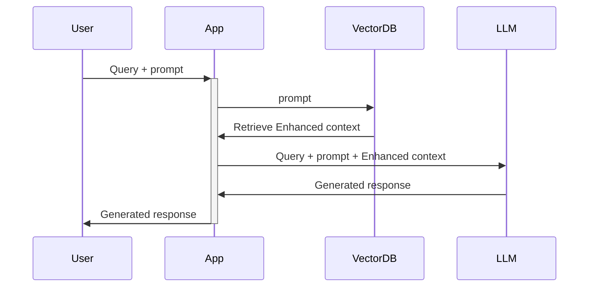

## Technical stack

| ML Framework  |LLM|LLM Framework|
|---|---|---|
|Ray|Mistral AI • Llama2|Langchain|   |
||||

## Purpose

- Develop a retrieval augmented generation (RAG) from scratch
- Make an application scalable (load, chunk, index, serve...)
- Evaluate different configurations of the app to optimize percomponent (ex: retrieval score) and overall performance (quality score)
- Implement a hybrid agent routing approach b/w OSS and closed LLMs to create the most performant and cost effective application.
- Servce application in high availability
- Fine-tuning, prompt engineering, lexical search, reranking, data flywheel, etc.

## Introduction

The aim of this project is to use LLM in a custom manner. LLM have been trained on a large amount of data. However must of the case, when we want to adapt them to a corporation, to our own documentations or even to recent informations published on the web, we are limited.

This is where the RAG (retrieval augmented generation) comes into play 🪄

RAG allows LLM to be updated with new infotmations without being retrained.

<a href="https://www.youtube.com/watch?v=T-D1OfcDW1M" target="_blank">
    
</a>


## Prerequisite and installations 

As we are going to use Ray, you will need to have the app 🙂. Normally it should be deployed in the cloud but I guess that a lot of you want to try it in local to avoid expensive cost. On my side, I used helm to deploy it on my mac m1. You will have the instruction on the makefile for those who have the same config. Otherwise please have a look on <a href="https://docs.ray.io/en/latest/ray-overview/installation.html" target="_blank">ray documentation</a>

So if you go for a kube in local, make sure you have a kube cluster and helm install.

Then this command should work ``` make deploy_ray ```. Careful to the architecture which is arm64 (you have in comment those for x86_64 in the makefile).

## Architecture

