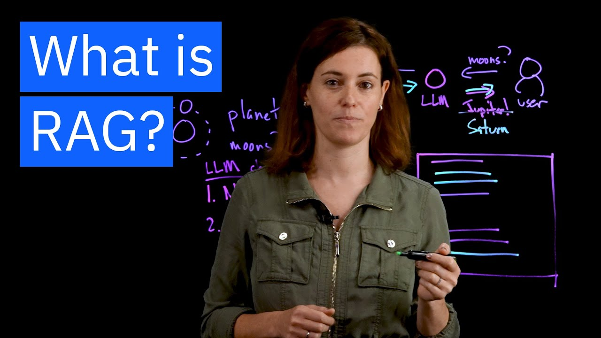

## Technical stack

| Framework  |   |   |   |
|---|---|---|---|
|Ray |   |   |   |
|  |   |   |   |

## Introduction

The aim of this project is to use LLM in a custom manner. LLM have been trained on a large amount of data. However must of the case, when we want to adapt them to a corporation, to our own documentation or even to recent informations published on the web, we are limited.

This is where the RAG (retrieval augmented generation) comes into play 🪄

RAG allows LLM to be updated with new infotmations without being retrained.

## Architecture

